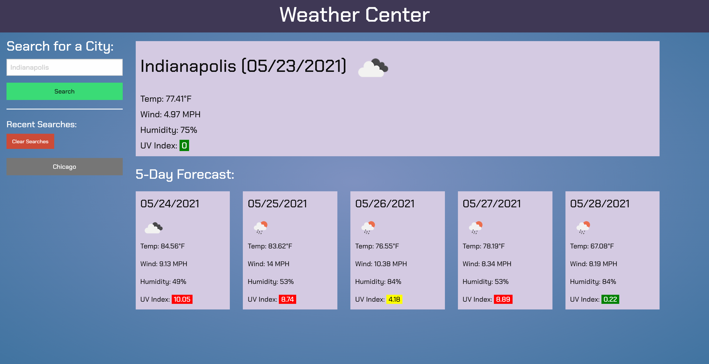

# Weather Center

Weather dashboard for Butler Boot Camp Challenge 6

## Built With
### Languages
* HTML
* CSS
* JavaScript

### Libraries / Frameworks
* JQuery
* Moment.js
* [Foundation](https://get.foundation/)
* Google Fonts

## Preview

## What's Here
* A user may input a city they'd like to view the weather for and current as well as future weather will be displayed to them.
* A user's prior searches are stored in a left-hand column. They are able to click on a city name and the weather data for that city will be displayed.
* Past searches are also saved to local storage and will be accessible on a page refresh.
* A user may also clear all prior searches should they so choose.
* A city's UV Index is color-coded to match UV index risk ranges [Green => Low, Yellow => Moderate, Orange => High, Red => Very High].
* The color scheme was derived from [here](https://colorswall.com/palette/80183/).

## Access the Project
* Github repository available [here](https://github.com/antellitocci/weather-tracker)
* Live web page available at [https://antellitocci.github.io/weather-tracker/](https://antellitocci.github.io/weather-tracker/)

## Future Thoughts / Closing Remarks
* OpenWeather API has map data as well. Would be interesting to add this along with the current weather information.
* Would also like to explore using Moment to get the day of the week for the weather data.
* I created the weather information boxes with JavaScript each time the function is run. To make a more streamlined user experience, I could create these and leave them in the HTML and just change the content each time the function is run. I suppose the reason, I did (and often do) it via JavaScript is in case I don't know how many HTML elements I may need. That said, I understand and appreciate that the lag in load time is cumbersome.
* Another thing, as far as user experience, is the inability to hit enter after typing the city name to have it search. I didn't consider this until late in the project and struggled to get it to function correctly. Whether that was the result of a Foundation quirk, or something else, I do not know yet.

### Made by Andrew Tellitocci
